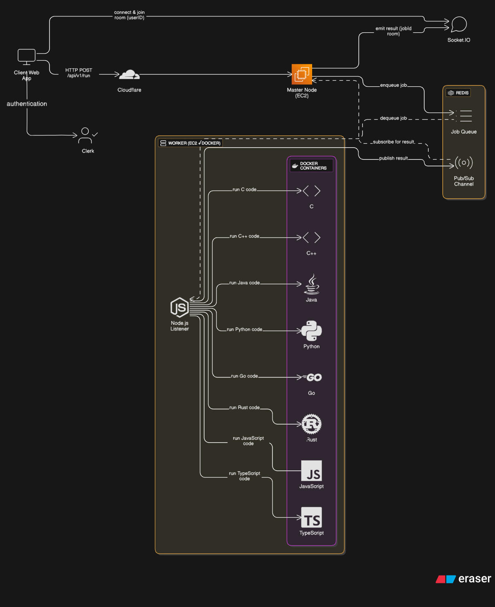
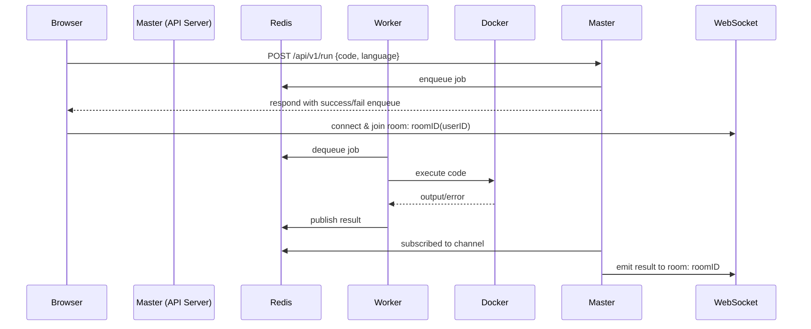

# 💻 Sandboxed Code Execution Platform

A secure, scalable, and extensible code execution platform supporting multiple programming languages, built using Docker, Redis, WebSockets, and a microservices-style architecture.

---

## 📚 Overview

This system allows users to submit code (in C, C++, Java, Python, Go, Rust, JavaScript, TypeScript) through a web interface. The code is executed securely in isolated Docker containers with strict time and resource limits.

---

## 🧠 Architecture Overview

### 🔹 Master Node Responsibilities
- Accepts code submissions via HTTP (`/api/v1/run`)
- Authenticates users (Clerk)
- Enqueues job in Redis queue
- Subscribes to result channel and emits to user via WebSocket

### 🔹 Worker Node Responsibilities
- Dequeues job from Redis
- Spins up Docker container per language
- Executes code with timeout/resource restrictions
- Publishes result to Redis

---

## 🖼 Architecture Diagram



> Showcases each language’s dedicated Docker setup and how workers handle jobs independently in secure containers.

---


## 🧱 System Components

### 🧑‍💻 Frontend (Browser)

- Sends a `POST /api/v1/run` request with `{ code, language }`
- Connects to WebSocket and joins a `room` named after the `jobId`
- Receives `{ output, error }` via real-time WebSocket message

---

### ☁️ Cloudflare

- DDoS protection
- Web Application Firewall (WAF)
- Reverse proxy to your master (API) server

---

### 🔐 Clerk (Authentication)

- Validates users on:
  - API layer (via HTTP headers)
- Ensures only authenticated users can submit jobs

---

### 🧠 Master Node (API Server)

- ECS or EC2 hosted
- Accepts code submissions
- Authenticates with Clerk
- Pushes job to Redis Queue
- Subscribes to Redis Pub/Sub for result
- Emits output back to the corresponding client room over Socket.IO

---

### 🔁 Redis (Job Queue + Pub/Sub)

- **Queue**: Stores jobs (`{ jobId, code, language, userId }`)
- **Pub/Sub**: Worker publishes output → Master receives → emits to client
- Used for decoupling request load from code execution.
- All code execution jobs are enqueued and picked by available workers.
- Pub/Sub used to notify master node when execution completes.
---

### 🧰 Worker Nodes (EC2 with Docker)


- Stateless Node.js service
- Subscribes to Redis queue
- Spins a Docker container with language-specific image
- Mounts `/app` as a volume (sandboxed code path)
- Executes the code with:
  - `--read-only`
  - `--network=none`
  - `--memory=100m`
  - `--cpus=0.5`
  - `--pids-limit=64`
  - `timeout 180s` wrapper
- Publishes result back to Redis Pub/Sub channel

Supported Languages:
- C (`sandbox-c`)
- C++ (`sandbox-cpp`)
- Java (`sandbox-java`)
- Python (`sandbox-python`)
- Go (`sandbox-golang`)
- Rust (`sandbox-rust`)
- JavaScript (`sandbox-javascript`)
- TypeScript (`sandbox-typescript`)

---

## 🔌 System Flow



## 📁 Folder Structure
```bash
sandbox-platform/
│
├── master/          
│   ├── controllers/
│   ├── routes/
│   ├── config/               
│   ├── services/
│   └── socket
│
├── worker/                 
│   ├── docker/             
│   ├── executor/
│   └── queue/
│
└── client/

```


## ⚙️ Docker Configuration
Each language has its own Dockerfile, e.g., for Python:
```bash
FROM python:3.10-slim
WORKDIR /app
ENTRYPOINT ["sh", "-c"]
```
Used with:
```bash
timeout 80 docker run --rm \
  -v "${tempDir}:/app" \
  --network none \
  --memory=100m \
  --cpus=0.5 \
  --pids-limit=64 \
  --read-only \
  sandbox-python "python /app/code.py"
```

## 🔐 Security Measures
- 🔒 Clerk: Validates every API & socket request
- 📦 Docker:
   - ```--read-only``` FS
   - ```--network=none```  to block internet access
   - Limited memory, CPU, PIDs
- 🕒 Timeout: 3-minute max execution via ```timeout``` command
- 🛡 Cloudflare: Blocks bots, rate limits abusers


## 🧪 Execution Lifecycle
- Client submits ```{ code, language }```
- Master validates, saves as ```pending``` with ```jobId```
- Master pushes job to Redis Queue
- Worker pops job, spins Docker, runs securely
- Worker publishes result via Pub/Sub
- Master receives it, emits to client via Socket.IO
- Client UI updates with output/error

## 💬 Real-Time Communication
- Socket.IO used
- Each job is mapped to a WebSocket room named ```job:<jobId>```
- Master sends result to only that room
- Helps support 1K–100K concurrent users with no overhead

## 🧠 Worker Logic Summary
```bash
while (true):
    job = redis.pop()
    container = docker.run(image_for(job.language))
    result = capture_output(container)
    redis.publish(job.id, result)
```


---

## 🔧 Future Improvements

- ✅ Rate limiting via Redis token bucket or API Gateway
- 🕳️ Better language error handling
- 📈 Worker autoscaling
- 🔍 Code static analysis before execution

---

## 📬 Contact

If you're interested in contributing or have questions, feel free to reach out or open an issue.

---

## 📝 License
[](https://opensource.org/licenses/MIT)